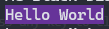
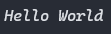

# Pawn Chalk

Terminal string styling done right

> [!IMPORTANT]
> For those people who are running the server directly (clicking samp-server.exe or omp-server.exe), there might be an issue where the console wont properly show the colors.
> Here's the solution, thanks to **Knife** for providing the solution:
> 1. Right click the top edge of console window.
> 2. Click the **Default**.
> 3. Navigate to **Terminal** tab.
> 4. And choose **command prompt** option in **default terminal application** drop-down menu.
> 5. Restart the server by closing the window.   
> 
> Reference: [here](https://discord.com/channels/231799104731217931/231799180127895553/1332736620473880778)

## Installation

1. Download from [the `releases` page](https://github.com/Tiaansu/pawn-chalk/releases) the desired version of the plugin for your platform.
2. Unpack the archive to the root directory of the server.
3. Add to the server configuration file the line:
    * samp server:
        * "*plugins pawnchalk*" - for Windows platform
        * "*plugins pawnchalk.so*" - for Linux platform
    * open.mp server:
        ```json
            "pawn": {
                "legacy_plugins": [
                    "pawnchalk"
                ]
            }
        ```

## Usage
* `chalk_bg`
    - Add a background color to a string
    - See [here](./pawnchalk.inc#L8-L164) to see the list.
    - Example:
        ```pawn
        new output[256];
        chalk_bg(RebeccaPurple, output, sizeof output, "Hello World");
        print(output);
        ```
    - Result:
    <p align='left'>
        
    </p>

* `chalk_fg`
    - Change the color of a string
    - See [here](./pawnchalk.inc#L8-L164) to see the list.
    - Example:
        ```pawn
        new output[256];
        chalk_fg(RebeccaPurple, output, sizeof output, "Hello World");
        print(output);
        ```
    - Result:
    <p align='left'>
        
    </p>

* `chalk_style`
    - Add styling to a string
    - See [here](./pawnchalk.inc#L169-L176) to see the list.
    - Example:
        ```pawn
        new output[256];
        chalk_style(Bold, output, sizeof output, "Hello World");
        print(output);
        ```
    - Result:
    <p align='left'>
        
    </p>

### There is also a function that directly returns the output
- return_chalk_bg
- return_chalk_bg_hex
- return_chalk_fg
- return_chalk_fg_hex
- return_chalk_style

### Other functions
- chalk_bg_hex
- chalk_fg_hex

> [!NOTE]   
> All of the natives now supports formatting.
