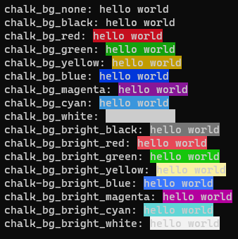
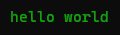
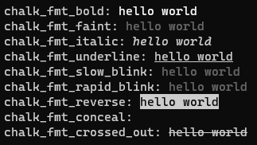
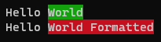
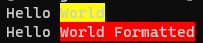
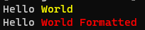
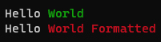
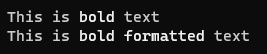

<h1 align="center">
	<br>
	<br>
	
	<br>
	<br>
	<br>
</h1>

> Terminal string styling done right

## Installation

1. Download from [the `releases` page](https://github.com/Tiaansu/pawn-chalk/releases) the desired version of the plugin for your platform.
2. Unpack the archive to the root directory of the server.
3. Add to the server configuration file the line:
    * samp server:
        * "*plugins pawnchalk*" - for Windows platform
        * "*plugins pawnchalk.so*" - for Linux platform
    * open.mp server:
        * for Windows platform:
            ```json
                "pawn": {
                    "legacy_plugins": [
                        "pawnchalk"
                    ]
                }
            ```
        * for Linux platform:
            ```json
                "pawn": {
                    "legacy_plugins": [
                        "pawnchalk.so"
                    ]
                }
            ```

## Usage 
* `chalk_bg_*`
    - Add a background color to a string.
    - See [here](https://github.com/Tiaansu/pawn-chalk/blob/main/tests/chalk.inc#L71-L87) to see the list of background colors available.
    - Example:
        ```pawn
            new bg_output[256];

            chalk_bg_none("hello world", bg_output);
            printf("chalk_bg_none: %s", bg_output);
            
            chalk_bg_black("hello world", bg_output);
            printf("chalk_bg_black: %s", bg_output);

            chalk_bg_red("hello world", bg_output);
            printf("chalk_bg_red: %s", bg_output);

            chalk_bg_green("hello world", bg_output);
            printf("chalk_bg_green: %s", bg_output);

            chalk_bg_yellow("hello world", bg_output);
            printf("chalk_bg_yellow: %s", bg_output);

            chalk_bg_blue("hello world", bg_output);
            printf("chalk_bg_blue: %s", bg_output);

            chalk_bg_magenta("hello world", bg_output);
            printf("chalk_bg_magenta: %s", bg_output);

            chalk_bg_cyan("hello world", bg_output);
            printf("chalk_bg_cyan: %s", bg_output);

            chalk_bg_white("hello world", bg_output);
            printf("chalk_bg_white: %s", bg_output);

            chalk_bg_bright_black("hello world", bg_output);
            printf("chalk_bg_bright_black: %s", bg_output);

            chalk_bg_bright_red("hello world", bg_output);
            printf("chalk_bg_bright_red: %s", bg_output);

            chalk_bg_bright_green("hello world", bg_output);
            printf("chalk_bg_bright_green: %s", bg_output);

            chalk_bg_bright_yellow("hello world", bg_output);
            printf("chalk_bg_bright_yellow: %s", bg_output);

            chalk_bg_bright_blue("hello world", bg_output);
            printf("chalk-bg_bright_blue: %s", bg_output);

            chalk_bg_bright_magenta("hello world", bg_output);
            printf("chalk_bg_bright_magenta: %s", bg_output);

            chalk_bg_bright_cyan("hello world", bg_output);
            printf("chalk_bg_bright_cyan: %s", bg_output);

            chalk_bg_bright_white("hello world", bg_output);
            printf("chalk_bg_bright_white: %s", bg_output);

            chalk_bg_rgb(255, 255, 0, "hello world", bg_output);
            printf("chalk_bg_rgb: %s", bg_output);

            chalk_bg_hex("#FF0000", "hello world", bg_output);
            printf("chalk_bg_hex: %s", bg_output);
        ```
        - Result:
        <p align="left">
            
        </p>

<hr>

* `chalk_fg_*`
    - Change the color of a string.
    - See [here](https://github.com/Tiaansu/pawn-chalk/blob/main/tests/chalk.inc#L90-L106) to see the list of colors available.
    - Example:
        ```pawn 
            new fg_output[256];

            chalk_fg_none("hello world", fg_output);
            printf("chalk_fg_none: %s", fg_output);
            
            chalk_fg_black("hello world", fg_output);
            printf("chalk_fg_black: %s", fg_output);

            chalk_fg_red("hello world", fg_output);
            printf("chalk_fg_red: %s", fg_output);

            chalk_fg_green("hello world", fg_output);
            printf("chalk_fg_green: %s", fg_output);

            chalk_fg_yellow("hello world", fg_output);
            printf("chalk_fg_yellow: %s", fg_output);

            chalk_fg_blue("hello world", fg_output);
            printf("chalk_fg_blue: %s", fg_output);

            chalk_fg_magenta("hello world", fg_output);
            printf("chalk_fg_magenta: %s", fg_output);

            chalk_fg_cyan("hello world", fg_output);
            printf("chalk_fg_cyan: %s", fg_output);

            chalk_fg_white("hello world", fg_output);
            printf("chalk_fg_white: %s", fg_output);

            chalk_fg_bright_black("hello world", fg_output);
            printf("chalk_fg_bright_black: %s", fg_output);

            chalk_fg_bright_red("hello world", fg_output);
            printf("chalk_fg_bright_red: %s", fg_output);

            chalk_fg_bright_green("hello world", fg_output);
            printf("chalk_fg_bright_green: %s", fg_output);

            chalk_fg_bright_yellow("hello world", fg_output);
            printf("chalk_fg_bright_yellow: %s", fg_output);

            chalk_fg_bright_blue("hello world", fg_output);
            printf("chalk-fg_bright_blue: %s", fg_output);

            chalk_fg_bright_magenta("hello world", fg_output);
            printf("chalk_fg_bright_magenta: %s", fg_output);

            chalk_fg_bright_cyan("hello world", fg_output);
            printf("chalk_fg_bright_cyan: %s", fg_output);

            chalk_fg_bright_white("hello world", fg_output);
            printf("chalk_fg_bright_white: %s", fg_output);

            chalk_fg_rgb(255, 255, 0, "hello world", fg_output);
            printf("chalk_fg_rgb: %s", fg_output);

            chalk_fg_hex("#FF0000", "hello world", fg_output);
            printf("chalk_fg_hex: %s", fg_output);
        ```
        - Result:
        <p align="left">
             
        </p>

<hr>

* `chalk_fmt_*`
    - Add / Change the style of a string.
    - See [here](https://github.com/Tiaansu/pawn-chalk/blob/main/tests/chalk.inc#L109-L117) to see the list of styles available.
    - Example:
        ```pawn
            new output[256];
            
            chalk_fmt_bold("this is bold text", output);
            print(output);

            chalk_fmt_italic("this is italic text", output);
            print(output);
        ```
        - Result:
        <p align="left">
            
        </p> 

<hr>

## There is also a custom function:
* `chalk_background`
    - Params:
        - color
            - The color of background.
            - See [here](https://github.com/Tiaansu/pawn-chalk/blob/main/tests/chalk.inc#L14-L31) to see the list of background colors available.
        - text
            - The string of text you want to apply the background color to.
        - {Float,_}:... (optional)
            - If your string need to be formatted, you'll use it.
    - Example:
        ```pawn
            printf("Hello %s", chalk_background(BG_Green, "World"));
            printf("Hello %s", chalk_background(BG_Red, "World %s", "Formatted"));
        ```
        This will return:  

<hr>

* `chalk_rgb_background`
    - Params:
        - r:
            - The R color value of background.
        - g:
            - The G color value of background.
        - b:
            - The B color value of background.
        - text
            - The string of text you want to apply the background color t.
        - {Float,_}:... (optional)
            - If your string need to be formatted, you'll use it.
    - Example:
        ```pawn
            printf("Hello %s", chalk_rgb_background(255, 255, 0, "World"));
            printf("Hello %s", chalk_rgb_background(255, 0, 0, "World %s", "Formatted"));
        ```
        This will return 

<hr>

* `chalk_hex_background`
    - Params:
        - hex:
            - The hex color string.
            - Example: `#FF0000` for red.
        - text
            - The string of text you want to apply the background color t.
        - {Float,_}:... (optional)
            - If your string need to be formatted, you'll use it.
    - Example:
        ```pawn
            printf("Hello %s", chalk_hex_background("#FFFF00", "World"));
            printf("Hello %s", chalk_hex_background("#FF0000", "World %s", "Formatted"));
        ```
        This will return 

<hr>


* `chalk_rgb_foreground`
    - Params:
        - r:
            - The R color value of foreground.
        - g:
            - The G color value of foreground.
        - b:
            - The B color value of foreground.
        - text
            - The string of text you want to apply the foreground color t.
        - {Float,_}:... (optional)
            - If your string need to be formatted, you'll use it.
    - Example:
        ```pawn
            printf("Hello %s", chalk_rgb_foreground(255, 255, 0, "World"));
            printf("Hello %s", chalk_rgb_foreground(255, 0, 0, "World %s", "Formatted"));
        ```
        This will return 

<hr>

* `chalk_hex_foreground`
    - Params:
        - hex:
            - The hex color string.
            - Example: `#FF0000` for red.
        - text
            - The string of text you want to apply the foreground color t.
        - {Float,_}:... (optional)
            - If your string need to be formatted, you'll use it.
    - Example:
        ```pawn
            printf("Hello %s", chalk_hex_foreground("#FFFF00", "World"));
            printf("Hello %s", chalk_hex_foreground("#FF0000", "World %s", "Formatted"));
        ```
        This will return 

<hr>

* `chalk_foreground`
    - Params:
        - color
            - The color of text you want to apply.
            - See [here](https://github.com/Tiaansu/pawn-chalk/blob/main/tests/chalk.inc#L36-L53) to see the list of colors available.
        - text
            - The string of text you want to apply the color to.
        - {Float,_}:... (optional)
            - If your string need to be formatted, you'll use it.
    - Example:
        ```pawn
            printf("Hello %s", chalk_foreground(FG_Green, "World"));
            printf("Hello %s", chalk_foreground(FG_Red, "World %s", "Formatted"));
        ```
        This will return: 

* `chalk_format_styles`
    - Params:
        - style
            - The style you want to apply.
            - See [here](https://github.com/Tiaansu/pawn-chalk/blob/main/tests/chalk.inc#L58-L66) to see the list of style available.
        - text
            - The string of text you want to apply the color to.
        - {Float,_}:... (optional)
            - If your string need to be formatted, you'll use it.
    - Example:
        ```pawn
            printf("This is %s text", chalk_format_styles(FMT_Bold, "bold"));
            printf("This is %s text", chalk_format_styles(FMT_Bold, "bold %s", "formatted"));
        ```
        This will return: 